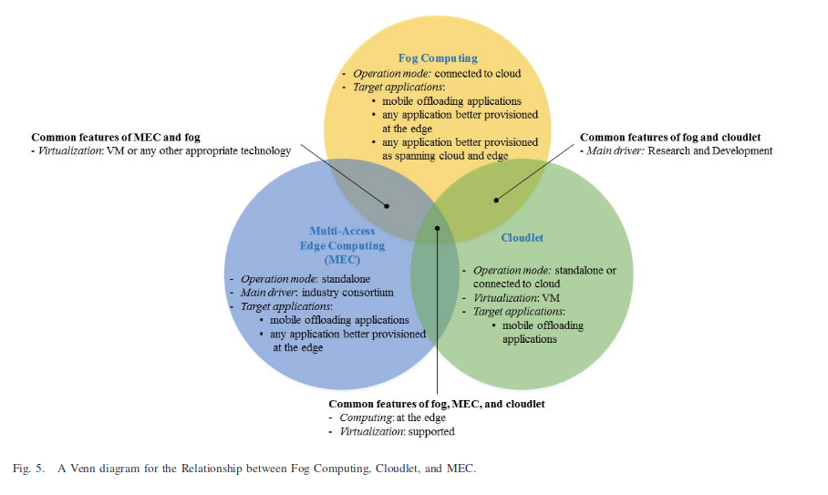

+++
title = "A comprehensive survey on fog computing: State-of-the-art and research challenges"
date = 2019-07-02

[taxonomies]
categories = ["distributed system", "研究", "論文リサーチ"]
tags = ["distributed system", "RPC", "cache"]
+++

分散システムについて調べていたらこの論文を見つけたので、読んでみました。

## 論文情報
サーベイ論文
```
@article{mouradian2017comprehensive,
  title={A comprehensive survey on fog computing: State-of-the-art and research challenges},
  author={Mouradian, Carla and Naboulsi, Diala and Yangui, Sami and Glitho, Roch H and Morrow, Monique J and Polakos, Paul A},
  journal={IEEE Communications Surveys \& Tutorials},
  volume={20},
  number={1},
  pages={416--464},
  year={2017},
  publisher={IEEE}
}
```

<!-- more -->
## 一言説明
- エンドデバイスとの距離によるレイテンシはクラウドコンピューティングの問題
- フォッグコンピューティングがその問題を解決する
  - リソースとクラウドの外のサービスをプロビジョニングできる
- この論文ではフォッグコンピューティングのサーベイ結果を提供する
- フォッグコンピューティングのアーキテクチャとアルゴリズムについて述べる
- 課題や研究についても紹介する

## まとめ

### Intro的な
#### Cyber Foraging
- 近くのサーバに重い処理を任せる、サーバはsurrogateと呼ばれる
- Surrogateはローカルディスクにデータベースの一部を持ってたりするかも
- Surrogateはデバイスに近いので低いレイテンシで結果の送信をすることができる

#### Cloudlet
- 2009年にSatyanarayananらが提案
- Cyber ForagingのVMバージョンって感じ

#### Multi-Access Edge Computing(MEC)
- モバイルネットワークと仮想化テクノロジーにフォーカスした2014年に提案されたもの
- しかし、2017年にnon-mobileネットワークに要件が変わった
- 5Gに向けた技術、Radio Access Networkを利用する
- ESTI主導でAPIの標準化なども行う

#### Fog Computing
- 2012年にCISCOで紹介された
- クラウドの存在は必須、Cyber ForagingやCloudletのようにスタンドアローンでの実行はできない
- エッジネットワークでの処理が可能
- n-tierアーキテクチャ
- クラウドと通信する必要があるときはWAN、なるべくLANを使う

#### 類似点、相違点（Cloudlet, MEC, Fog Computing)
- MECのみ業界コンソーシアムで推進されている
- CloudletはVMのみに頼る、他の2つは仮想化技術に頼ってる
- MECはスタンドアローンに動作する
- Cloudletはスタンドアローン、クラウド、どちらでも動作する
- 

### Fog Computingの使用例とか
#### ユースケースの例示
- CDNとしての利用
- 火災報知器としての利用

### アーキテクチャ

### アルゴリズム


## 次に読むべき論文
- A Secure Content Caching Scheme for Disaster Backup in Fog Computing Enabled Mobile Social Networks
  - https://ieeexplore.ieee.org/abstract/document/8395067
