+++
title = "Distributed System of Apocalypse"
date = 2019-07-26

[taxonomies]
categories = ["distributed system", "研究", "進捗"]
tags = ["distributed system"]

+++

分散システムについて調べたことをまとめていきます。
- 論文読む
  - Orion: A Distributed File System for Non-Volatile Main Memories and RDMA-Capable Networks

<!-- more -->

```
@inproceedings {227790,
author = {Jian Yang and Joseph Izraelevitz and Steven Swanson},
title = {Orion: A Distributed File System for Non-Volatile Main Memory and RDMA-Capable Networks},
booktitle = {17th {USENIX} Conference on File and Storage Technologies ({FAST} 19)},
year = {2019},
isbn = {978-1-931971-48-5},
address = {Boston, MA},
pages = {221--234},
url = {https://www.usenix.org/conference/fast19/presentation/yang},
publisher = {{USENIX} Association},
month = feb,
}
```

## 一言説明
- NVMMストレージのための分散ファイルシステム
  - clean state
  - NVMMの高速性
  - RDMAのネットワーク


## 提案手法

## 既存研究との違い

## 検証手法

## 次に読む論文

## 内容まとめ

### 1 Introduction
- NVMMは圧倒的パフォーマンスを提供する
- NVMMが主流になったDistributed File Systemでは以下の要因が主なボトルネックとなる
  - ネットワークパフォーマンス
  - ソフトウェアオーバヘッド
  - データの入れ替え
- NVMMはbyte-addressableなので、ブロックベースのインタフェースは必要ない
- OrionはNVMMとRemote Direct Memory Access(RDMA)のためのDFS
- Orionは以下の分野に焦点を当ててる
  - RDMA
    - メタデータとデータアクセスを高速化できるときはRDMAを使う
  - ソフトウェアのオーバヘッド
    - 従来の分散ファイルシステムは、ネットワークとストレージを分けた２レイヤーのデザイン
    - それは、メタデータの重複や、過度なコピー、不必要なイベントハンドリングをする
    - Orionでは、ネットワークとストレージ関数を一つに、RDMAとNVMMに最適化したカーネルレイヤーへ統合した
  - locality
    - RDMAは早いけど、NVMMのアクセスと比べると、10倍程度遅い
    - Orionでは永続的なデータをクライアントへ移行し、空きスペースを効率的にかんりするために新しいdelegated allocation schemeを使う
- Orionは今までのDFSを圧倒的に上回っており、単一のコンピュータでアプリケーションを動かした時に匹敵するパフォーマンスを出している
- Section.2では、NVMMとRDMAを使ったDFSの機械と挑戦について話す
- Section.3では、Orionの全体的なアーキテクチャについて述べる
- Section.4, Section.5では、メタデータとデータのアクセスの高速化の実装をどう決めたかについて話す
- Section.6では、これらのメカニズムを評価する
- Section.7では、関連研究
- Section.8は締め

### 2 Background and Motivation
- NVMMとRDMAのバックグランドについて
- NVMMをDFSで使うことの固有の非効率性について

#### 2.1 Non-Volatile Main Memory
- NVMMは不揮発性のDIMM(NVDIMM)から構成される
- 色々なNVDIMMモジュールが研究・提供されてる
  - 3DX-Point memory
  - SPIN-TORQUE TRANSFER RAM(STT-RAM)
  - ReRAM
- NVMMのために作られたファイルシステムがある
- キャッシュフラッシュとメモリバリアを用いてNVMMへの更新を慎重に順序づけて、クラッシュの一貫性を保証しなければいけない

#### 2.2 RDMA Networking
- RDMAの説明をしてる
- pin-down cacheなるものを用いて、仮想アドレス空間にもアクセスできるRDMA NIC(RNIC)
- RDMAリクエストをverbsという
- inbound verbsは軽いらしい
  - Orionではその特性を色々使ってスケーラビリティを上げてるらしい
- RDMAのアクセスはローカルアクセスより遅い
  - それはそう、64Bのアクセスだと~9倍、4KBのアクセスだと~20倍
- RDMAは小さいパケットを送信するとトランザクションがより少なくなるらしい
  - つまり、小さいパケットが好み
  - https://www.usenix.org/node/196244
- RDMAのwriteは持続性がない
  - commit(RDMA Durable Write Commit)でできるらしい
  - でもまだ使えないので、CPU involvement(Software mecha-nisms for enabling access to remote persistent memory)

### 3 Design Overview
- Orionのデザインゴール
  - 低いソフトウェアオーバヘッドのスケーラブルパフォーマンス
    - スケーラビリティと低レイテンシはNVMMのパフォーマンス発揮に必須
    - 以下で達成してる
      - functionとnetwork操作の統合
      - RDMAを通しての直接のNVMMのデータアクセス
  - metadataアップデートによる効率的なネットワークの使用
    - クライアントはファイルをキャッシュしており、変更が生じた際はメタデータを送るだけでいい
  - metadataと一貫性
    - log-structuredデザイン
    - 読み込みは並列、書き込みは直列だけ
      - metadataを保証するinode logの更新
      - コンフリクトを解消するclient arbitrationという新しいcoordination scheme
  - DFSのDAXのサポート
    - DAX(direct load/store)のサポートはNVMMにとっていい
    - クライアントにローカルNVMMのFSにアクセス可能にする
  - 繰り返しのアクセスがローカルアクセスになる
    - クライアントキャッシュ
    - log-structuredはキャッシュ一貫性を維持するコストを下げる
  - 信頼性とデータ持続性
    - metadata, リプリケーションとアベイラビリティーの達成
    - replicationプロトコルはデータ持続性を保証する

#### 3.1 Cluster Organization
- Orionは以下の構成から成る
  - Metadata server(MDS)
  - data stores(DSs)
  - RDMAネットワークで繋がっているクライアント
  - 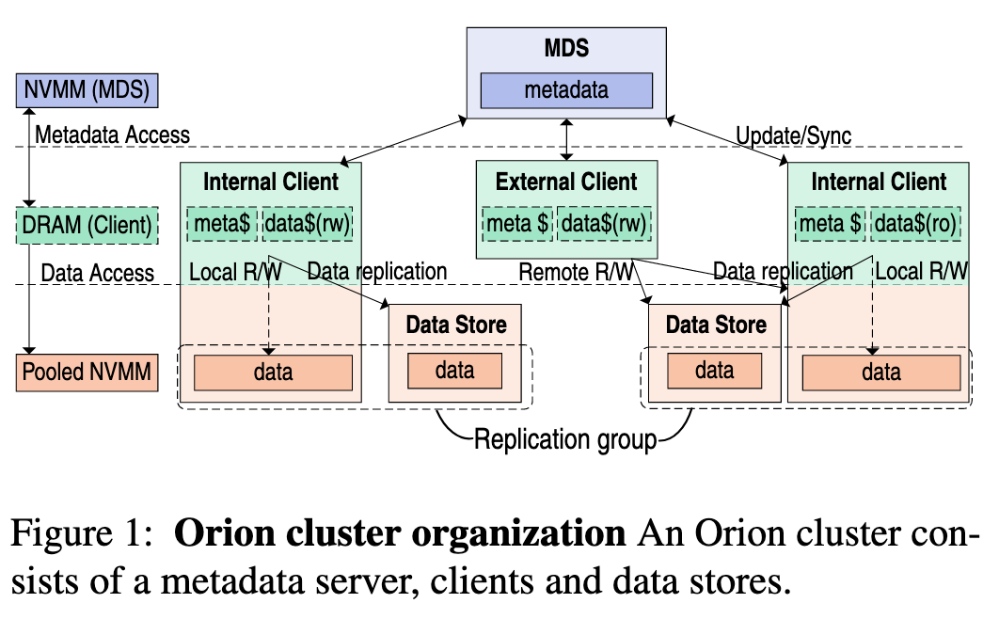
- MDS
  - metadataの管理
  - クライアントへのRDMAコネクションの接続
  - クライアントはmetadataをMDSへ伝える
- Orionはクライアントにグローバルへの管理とアクセスを許可している
  - ここでグローバルとはNVMMのプール
- ファイルデータは複数のDSに渡って存在することもある
- Internal clientsはローカルのNVMMを持ってるからDSsのように振る舞える
- External clientsはNVMMを持っていないため、データアクセスはできるが、データのストアはできない
- Orionはdataとmetadataのリプリケーションをサポートしてる
  - Mojim-style replication
  - Mojimは低レイテンシリプリケーションを提供
- OrionはDSsをリプリケーショングループとして組織
  - グループ内のDSsは同一のデータレイアウトを持つ
- Orionはブロードキャストのリプリケーションを使う

#### 3.2 Software Organization
- OrionのソフトウェアはクライアントとMDSで動いてる
  - POSIXインタフェース
  - NVMMのファイルとmetadataを管理、MDSとクライアントの通信処理をするカーネルモジュール
    - カーネルで処理を走らせることで不用意なコンテキストスイッチを無くしてる
    - シングルレイヤーの工夫
- OrionのファイルシステムはNOVAを継承している
  - log-structured POSIX-compliant local NVMM file system
  - inode log data structureはNOVAから受け継いだ
- 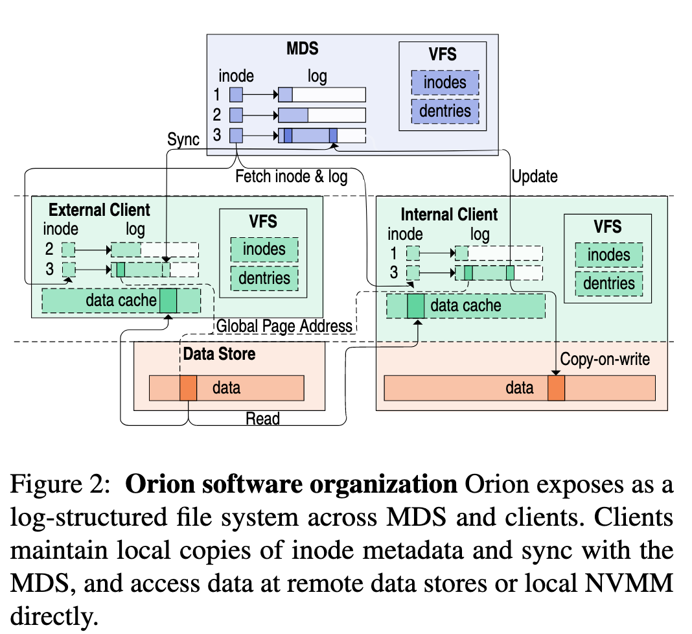
- Orionのinode
  - NVMMの連結リストのmetadata logのheadとtailのポインターを持つ
- OrionはログをVFS inode作るために使ってる
- MDSはmetadataの全体的な構成を持ってる
- クライアントへのログのコピーはmetadataの管理を簡単・高速にする
  - クライアントはログを辿ることで、metadataを復元することができる
- Orionはデータを分散しておくために、global page addreses(GPAs)を使っている
- Orionクライアントはクライアント側のデータキャッシュも行う
  - キャッシュはcopy-on-writeに紐づいてる

### 4 Metadata Management
- metadataの更新はクリティカルパスなので速くやらないといけない

#### 4.1 Metadata Communication
- MDSはOrionのmetadata通信を組織しており、metadataの更新はそこで行われる
  - クライアントはmetadataのfetch,更新metadataの送信をMDSにする
- クライアントは操作の複雑性に応じて、以下の3つの方法でMDSと通信できる
  1. direct RDMA reads
  2. log commits
  3. Remote Procedure Calls(RPCs)
- RDMA reads
  - MDSからmetadataを引き出す時、one-sided RDMA readsを使う
  - クライアントはファイルのためにinodeとlogにNVMMはbyte-addressableだから、RDMA readsを使ってアクセスできる
    - このアクセスはMDS CPU経由で、スケーラビリティを上げる
- Log commits
  - クライアントはmetadataの更新の際にlog commitsを使う
  - RDMA sends
  - 分散ロック(client arbitration)なしで、複数のクライアントが単一のinodeのログをcommitできる
- Remote Procedure Calls
  - 複数のinodeに関与するmetadataのアクセスにはRPCsを用いる
    - O_APPENDフラグでのファイル書き込みなど
  - OrionのRPCはverbとRDMA writeを使う
- 例
  - 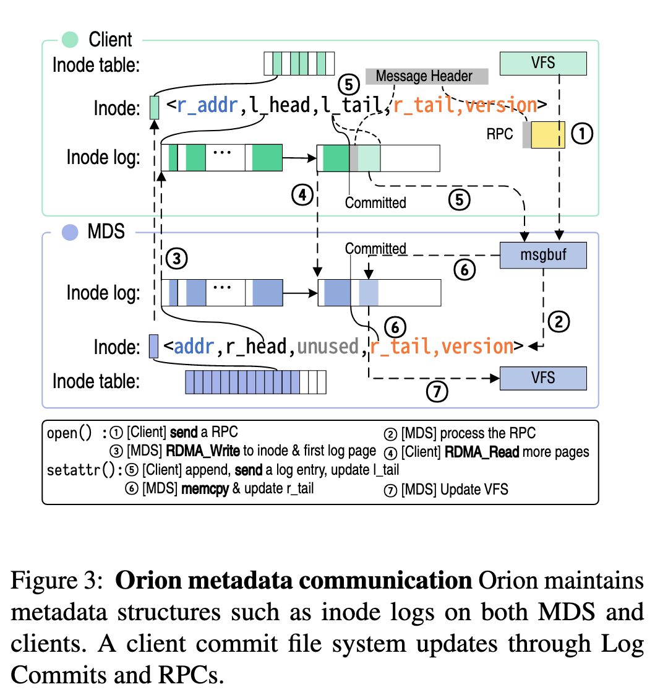
    - RPC-based metadata updata
- RDMA Optimizations
  - Orionは相対ポインターを使ってる

#### 4.2 Minimizing Commit Latency
- リクエスト処理のレイテンシはI/Oパフォーマンスに重大
- 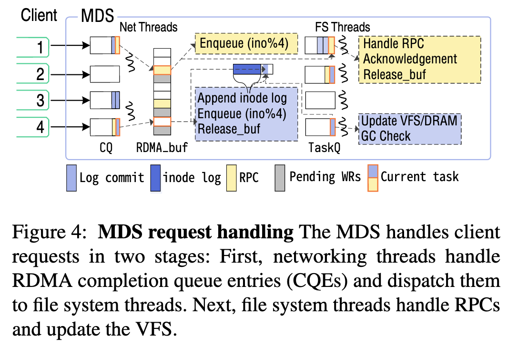
- MDSはそれぞれのクライアントごとに、通信のためにNVMMに256KBの通信バッファを用意
- MDSはリクエストを2段階で処理する
  1. ネットワークスレッドがRDMA completion queues(CQ)をpollsしてfile system threadへディスパッチ
  2. File System threadsがRPCを処理して、VFSを更新
- 最適化のため、ネットワークスレッドにログエントリーを直接付け加えられることによって、log commitsに優先順位がつけられる
- log commitのためにNTはinode番号を読み、non-temporal movesを発行してエントリーを加え、tail pointerを更新する
  - ほかのクライアントはコミットされたエントリーを読め、ローカルに適応できる
  - NTはrecv verbをポストしてrecvバッファを解放し、再利用する
  - Finally, it dispatches the task for updating in-DRAM data structures to a file system thread based on the inode number.
- File SystemはGCを走らせる

#### 4.3 Client Arbitration
- Client Arbitrationは以下のような事項により成り立った？
  1. inbound RMDA readの処理は、outbound writeよりコストが低い.実験では、1秒で15MBのinbound reads / 1.9MBのoutbouhnd writes
  2. MDSでは、一貫性を保つための初期化メッセージがOrionのパフォーマンスを落とす
  3. ログを追加する操作は軽い: 500 CPU cycles
- クライアントはログの長さを確認してinodeが最新かどうかを確認する
  - ログの長さはtail pointerからRDMA read
- 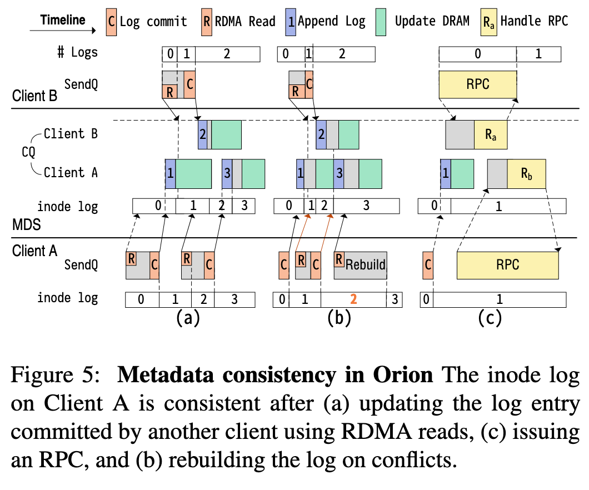
- rebuildは以下の時に起きる
  - 2つ以上のクライアントが同じファイルにアクセスし、それらの1つがログコミットだった場合
  - 1つのクライアントが続けて二つ以上のログコミットを発行した場合
  - MDSがクライアントのログコミットを受け入れたが、その前に他のクライアントがinode tailをRDMA readsしている時
- これらの状況は"window of vulnerablility"のため、なかなかならない
  - ログを追加する時間は短いから
- rebuildを避けるために、OrionはRPCを使ってinodeの更新をしてる

### 5 Data Management
- OrionのNVMMはinternal clientsとdata storesに分散してる

#### 5.1 Delegated Allocation
- クリティカルパスなデータのアロケートを避けるために、Orionは分散した、２ステージのメモリ割り当てスキームを使う
- MDSは全てのページのbitmapを保持している
- クライアントはRPC経由でMDSに大きいチャンクスペースをリクエストできる
- このデザインはMDSをfine-grain data blocksから解放し、クライアントに低いオーバヘッドでページ割り当てをさせる
- ローカルの書き込みは速いため、可能な時はMDSはinternal clientsにローカルNVMMのチャンクを割り当てる

#### 5.2 Data Access
- クライアントはRDMAでDSと通信するか、ローカルNVMMにDAX経由でアクセスしてデータを読む
  - RDMAでは、データを読み、それを将来キャッシュとして読むためlocalのDRMAに配置しておく
- アロケーションが起こるため、リモートの書き込みはone-sided
  - 転送が終わると、クライアントはログコミットを発行する
- 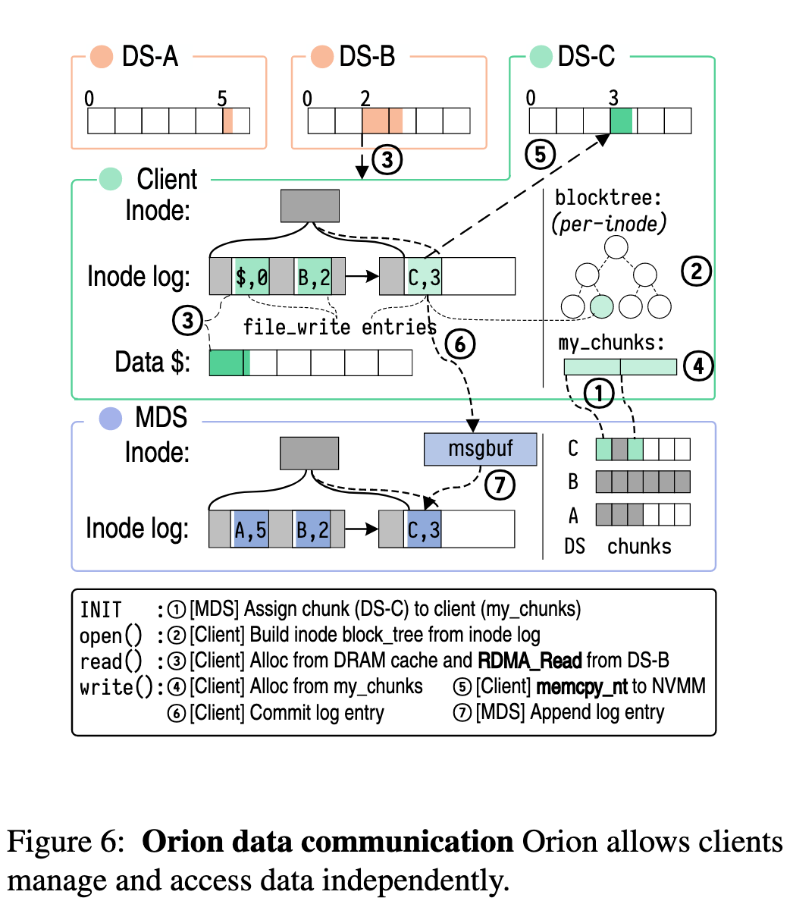

#### 5.3 Data Persistence
- Orionはデータの一貫性を保証しているが、多くのファイルシステムのように、ユーザプリファレンスとリプリケーションの可用性に基づいたデータの一貫性の要件を和らげる
- Orionのデータ一貫性保証の本質は、MDSがファイルアップデートのログコミットが遅れることの拡張である（は？）
  - 弱い一貫性の保証のため、external clientはDSの更新が終わっていなくても、MDSにログコミットを送ることができる
  - この一貫性レベルは、ext4のwrite-backモードと同等であり、データページが破損する可能性はあるが、metadataの生合成は維持される
  - NOVAとdata journaling modeのext4と同等の強い一貫性は、Orionはファイル更新が終わるまで、ログコミットを遅延させることができる
- RDMAを用いた強い一貫性への達成は、難しい
  - RDMAハードウェアがリモートのNVMMに書き込みを強いる基本的なメカニズムを提供していないから
  - データ更新の強い一貫性のために、アルゴリズムを以下のように考えた
    - ファイルアップデートに一貫性が欲しいクライアントは、新しいページを適切なreplica groupの全てのノード上に割り当てるcopy-on-writeを使い、RDMA writesでページを更新する
    - 平行して、クライアントは投機的なログコミットをMDSに送る
- replica groupのDSsは、RDMAトリックを使った新しいページへのRDMA writeを検知する
  - クライアントがRDMA writeを新しいページにする時、ターゲットへのRDMAパケットヘッダ内の即値として、pageのglobal addressを含む
  - この値は、ターゲットのNICのcompletion queueを表す
  - だから、DSはそのページの修正を検知することができる
  - 更新されたページごとに、DSはNVMM内のページに強い、小さいRDMA write経由で確認応答を送る
    - これは、十分な数の確認応答を受け取ると、ログコミットを処理する

#### 5.4 Fault Tolerance
- 高性能で高密度のNVMMはノードの再構築を復元するより難しくする
  - 結果、Orionはエラーを検知した後に、回復するのにめっちゃ頑張ってる
  - ノードが回復しなかったら（例えば、電源が落ちた後のバグとか）、Orionクラスタに再ジョインし、一貫した状態に早急に回復する
  - NVMM media errors, module failures, data-corrupting bugsのために、Orionはレプリカを用いてデータとメタデータの再構築ができる
  - 相対ポインタとNVMM内のmetadataを保証するglobal page addressesを使って、停電後もNVMM metadataは残ってるらしい！
- metadataのサブシステムでは、MDSのfailuresのために、OrionはメインMDSとミラーから成るMojim-likeな高可用性のペアーを作る
  - 全てのメタデータアップデートはメインのMDSに流れる
  - そしてミラーに変更を伝搬させる
  - メインに障害が起きると、ミラーはリクエストを処理し、メインはリカバーする
- data左b具システムでは、DSの障害のため、DSはRDMA writeリクエストの即値を記録する
  - DSの失敗はレプリケーションからデータを得て復帰する
  - ノードが死んだ時、他のグループは強い一貫性モードで動く

### 6 Evaluation
- 既存のDFSと比べて性能評価
  - 以下のクエスチョンに答える
    - one-layerデザインがパフォーマンスにどう影響を与えているか
    - dataとmetadataの管理がどのくらいのオーバーヘッドをlocal NVMM file systemと比べて加えてるか
    - 異なるレベルの信頼性のためにOrionの設定がどの程度パフォーマンスに影響を与えるか
    - どのようにOrionのMDSをスケールするか
  - 実験セットアップを述べてから評価を行う
    - micro, macroベンチマーク

#### 6.1 Experimental Setup
- OrionをDRAMのpersistent memoryをエミュレートする10ノードのクラスターで実行させた
  - それぞれのノードは2つのクアッドコア(Intel Xeon Westmere-EP)と48GBのDRAMを持っている
    - pmem デバイスをエミュレートする32GBもある
  - それぞれのノードはInfiniband modeで動き、Infiniband switch(QLogic 123000)と繋がっているRDMA NIC(Mellanox ConnectX-2 40 Gbps HCA)を持ってる
  - DSsのDirect Cache Accessは止めてある
  - co-locatedアプリケーションの影響を実証するために、それぞれのクライアントのRDMAリクエストの処理と発行を一つのコアに集中させた
- Mellanox OFEDからのOrion verb kernel modulesが乗ったLinux4.10 kernel上でOrionのプロトタイプを作った
  - OrionのFSはNOVAからのコードを再利用し、分散関数とデータ構造のサポートのために8000行くらいコードを追記した
  - ネットワークモジュールはスクラッチから作成し、8000行のコードから成る
- Ceph, Gluster, Octopusと比較する
  - リモートのRDMA(iSER)のiSCSI拡張を使ったRAMをホストするiSCSIにマウントされたext4とも比較する（ha?）
  - 最終的に、二つのローカルDAXファイルシステムと比較
    - NOVAとext4-DAX

#### 6.2 Microbenchmarks
- 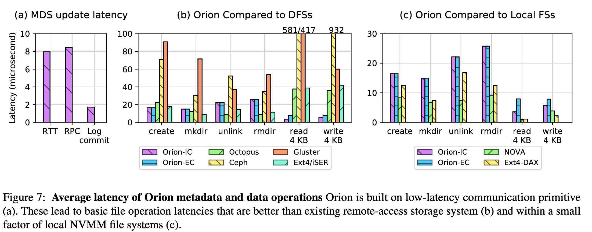
- ログとRPCのレイテンシを計測することから始める
  - (a)で示してる
  - 7.96µsのRTT
  - RPCリクエストとリソースを得る発行のレイテンシは8.5µs
  - ログコミットはクライアントは応答を待つから、より低いレイテンシ、2µs
- (b)では、metadata操作のレイテンシを示してる
  - CephとGlusterのレイテンシが34%から443%、Orionより高い
  - Octopusはmkdir, unlink, rmdirでOrionより良い
    - Octopusは簡単なファイルシステムを使ってるから
      - ファイルとディレクトリが、一つのサーバのフルパスによってインデクスされたHashTableで管理されてる
      - それぞれのファイルとディレクトリにファイル拡張とディレクトリエントリを割り当ててる
      - この簡単化は大きいファイルやディレクトリを管理できないことを意味している
- Ext4/iSERはいくつかのmetadata操作でOrionを超えている
  - block queueに入るとmetadataの更新が完了するから
  - 反対に、NVMM-aware システムはmetadataの一貫性ある更新のためにフルレイテンシがある
  - I/Oレイテンシは良い感じ
- ファイル読み込み、書き込みでは、Orionは低いレイテンシ
  - Orion internal clients(Orion-IC)では、良い感じ
  - Orion external clients(Orion-EC)でもまーまー
- (C)では、OrionとNOVAとExt4-DAXを比べてる
  - metadata操作では、OrionはRPCをMDSへ送っている

#### 6.3 Macrobenchmarks
- 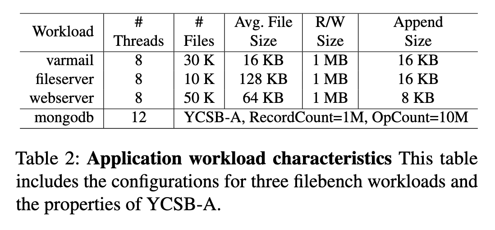
- 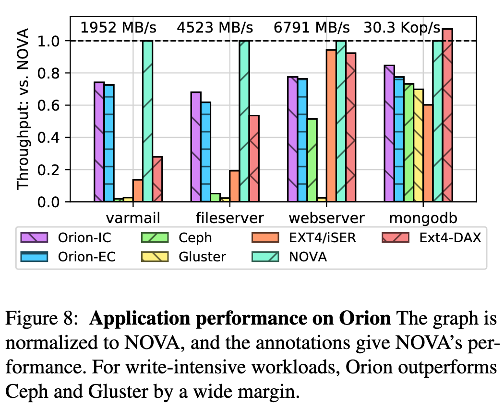
  - 図見て
- 3つのFilebench workloads(varmail, fileserver, webserver)を使った
  - YCSBのMongoDB
  - 図見て

#### 6.4 Metadata and Data Replication
- 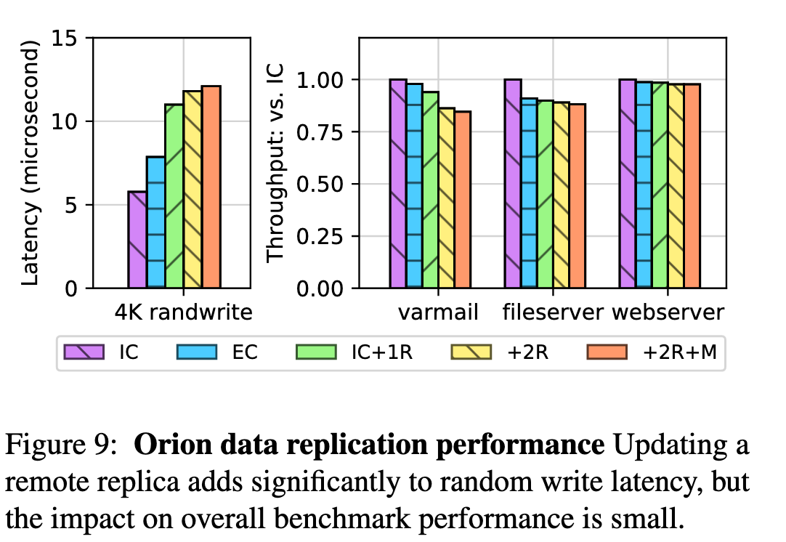
  - 図見て

#### 6.5 MDS Scalability
- 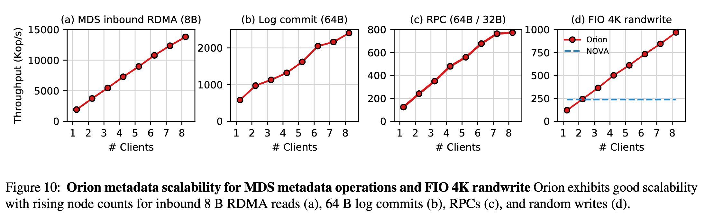
  - 図見て

### 7 Related work