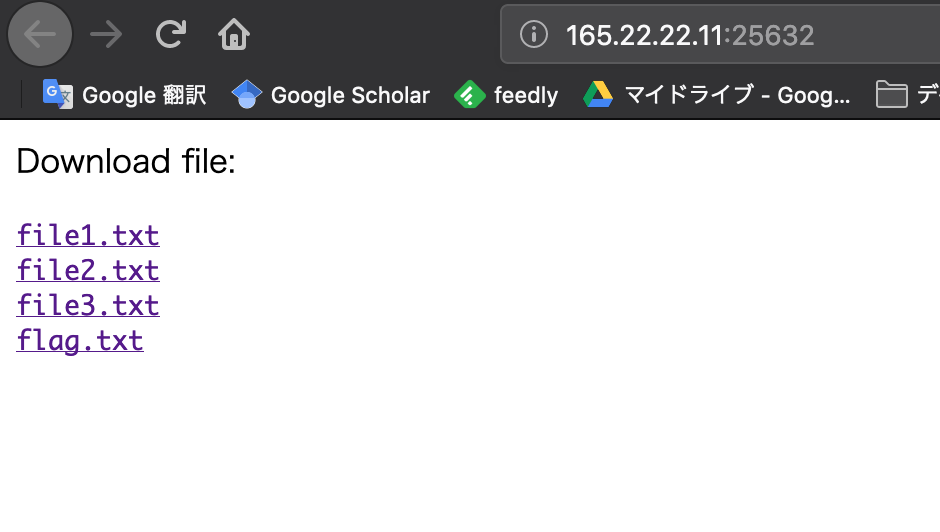
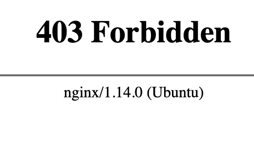
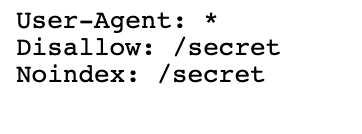
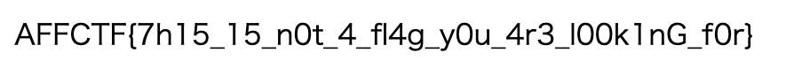

+++
title = "Affinity CTF 2019 writeups"
date = 2019-09-09

[taxonomies]
categories = ["ctf", "writeup"]
tags = ["cache"]

+++

Affinity CTF 2019 のwriteupを適当に書いていきます．

- Download me

<!-- more -->

## Download me

サイトのURLが渡されたのでアクセスします．

4つのファイルをダウンロードでき，flag.txtがあります．これをダウンロードするようですね．

試しにfile1.txt~file3.txtをダウンロードしてみると正常にダウンロードできました．
flag.txtを同じように試してみると，Invalid tokenと言われダウンロードできません．

ダウンロードの際に，以下のようにファイル名とトークンが一致する必要があるようです．

```
http://165.22.22.11:25632/download.php?file=file3.txt&token=65658fde58ab3c2b6e5132a39fae7cb9
```

flag.txtではtokenが空になっています．

アプローチとしては以下を考えました．

- .htaccessやrobots.txtを探して重要情報を引き出す
- 変数に異常値を入れて脆弱性を探す
- tokenを総当たりする

### .htaccessやrobots.txtを探し絵重要情報を引き出す

まずは.htaccessへアクセスしてみます．



403 Forbidden...

次はrobots.txtを試します．



/secret以下にアクセスできるようです．



お，フラグゲット？？フォームに入力してみると...

Invalid.

This is not a flag looking for.

ぐぬぬ...

### 変数に異常値を入れて脆弱性を探す

正規表現やパスを入れてみましたがきちんと処理されているみたいです．

### token総当たり

128bitのtokenだったので，md5か何かだろうと思い総当たりを試しました．

```python
import hashlib
import requests

for i in range(0,1000):
    token = hashlib.md5(str(z).encode('utf-8')).hexdigest()
    url = "http://165.22.22.11:25632/download.php?file=flag.txt&token=" + token
    conn = requests.get(url)
    if "CTF" in out.decode('utf-8'):
        print(out)
```

実行するとフラグをゲットしました．やったぜ．

### 対策

もっと質のいいhash関数を使うべし！！！